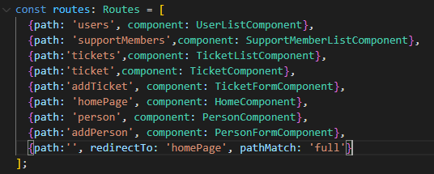

# sir-tp10-IntegrationBack-Front
### Par Roberto Chacon et Manh-Huan NGUYEN.

## **Setup**

Pour démarrer, veuillez lancer la classe ***RestServer*** de l'application back.

Ensuite, veuillez lancer le front depuis le dossier du projet *ticket-ui* :

```
ng serve
```

Une fois l'application lancé, vous pouvez l'ouvrir dans l'adresse : 

```
http://localhost:4200/
```

&nbsp;
## **Première étape** 
&nbsp;

### **Modification des routes**

Afin de regler les problèmes de CORS, nous avons crée un fichier ***proxy.config.json*** dans lequel nous avons ajouté la route vers l'API :

```
    "/ticket-api": {
        "target": "http://127.0.0.1:8090",
        "secure": "false",
        "pathRewrite": {
            "^/ticket-api": ""
        },
        "logLevel": "debug"
    }
```
Et nous avons ajouté la configuration du proxy dans le fichier de configuration CLI : ***angular.json***
```
    "serve": {
        "builder": "@angular-devkit/build-angular:dev-server",
        "options": {  
            "proxyConfig": "src/proxy.conf.json"
    }
```

Finalement, our utiliser plus simplement cette route dans notre code, nous avons crée une variable global dans ***environments.ts** afin de pouvoir l'appeler depuis n'importe où. 

```
export const environment = {
    production: false,
    ticketApi: "/ticket-api",
}
```

## **Deuxième étape**

## Création des modèles

Pour rappel, vous pouvez trouver la documentation de l'API dans le lien suivant : 
```
http://localhost:8090/api/
```

Notre front est composé des modèles suivants : 
- **Person**
    - **User** héritant de Person.
    - **SupportMember** héritant de Person.
- **Ticket**

Nous avons utilisé des outils en ligne pour convertir notre API en modèles TypeScript afin de faciliter le démarrage.


## Création des services

L'application dispose de deux services principales qui vont permettre de communiquer avec l'API : 

- **Ticket service** : Permettant des opérations telles que : 
    -   GET un ticket par son ID.
    -   GET tous les tickets.
    -   POST un ticket à la bdd.


- **Person service** : Permettant des opérations telles que : 
    -   GET une personne par son ID.
    -   GET toutes les personnes de type USER.
    -   GET toutes les personnes de type SUPPORT-MEMBER.
    -   POST un user à la bdd.
    -   POST un support-member à la bdd.

## Création des composants

Nous avons implementé des différents composants en fonction des différentes pages de notre application.
Le but étant de pouvoir obtenir les données de la base de données ainsi que l'enregistrement de celles-ci, nous avons crée les composants suivants : 

- **Composants d'affichage** : *person-list*, *user-list* (héritant de person-list), *support-member-list* (héritant de person-list) et *ticket-list*. Ces composants vont se communiquer avec les services afin d'obtenir les données et les afficher dans leurs pages respectives.

- **Composants d'enregistrement** : *person-form*, *ticket-form*. Ce sont des formulaires permettant de lancer les rêquetes POST et pouvoir ainsi enregistrer les données en base.

- **Composants généraux** : *home*, *person* et *ticket*. Ces composants ne sont que des menus qui gèrent les routing vers les composants d'affichage ou d'enregistrement.

## Création de routing.

- On a configuré des routing pour gérer la navigation de notre application. Une route dans sa forme la plus basique est l'association d'un composant et d'une  URL. Lorque cette URL est demandée, le module de routage effectue le rendu du composant associé. 
 - Pour effectuer cette association d'une URL à un composant, il faut définir une variable de type Routes. Ce type est déclarer comme étatn un tableau dont chaque élément est un objet de type Route.

- Une route est donc composée d'un attribut path qui réprésente l'URL (relative ou absolue) associé à cette route et d'un attribut component qui est le composant à charger lorsque cette route est appelée. 


