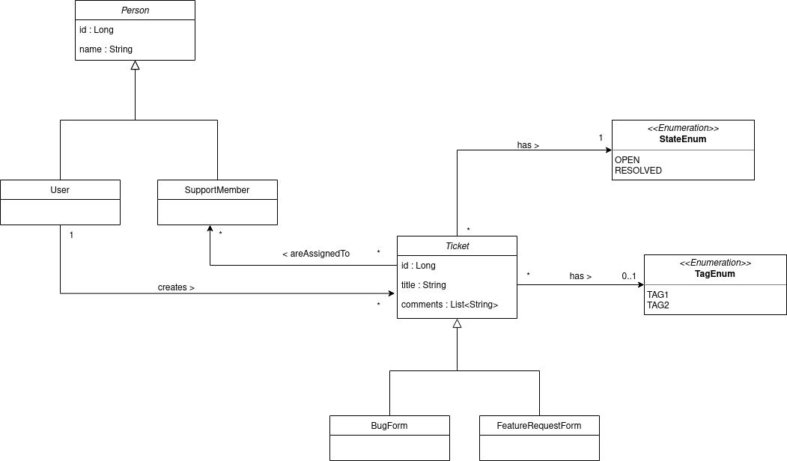
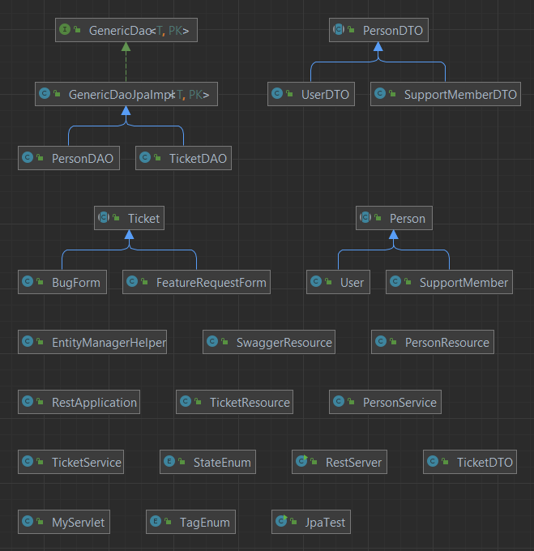

# TP2-5 SIR

### Fait par Roberto Chacon et Manh-Huan NGUYEN.

Ce guide vous permettra de tester les differentes parties du TP.
## Diagramme de classes

Notre implementation a été concu à partir du diagramme de classes suivant :


## Partie JPA

Afin de tester la partie JPA et alimenter la base de donnees, veuillez modifier l'user, url et mot de passe du fichier **persistence.xml**, et lancez ensuite la classe **JPATest**.


## Partie Servlet

Nous avons construit une page web qui retourne des informations issues de la base de données et un formulaire qui permet
d’ajouter des éléments dans la base de données à l'aide des Servlet.
Pour la tester, il suffit de lancer la commande :

```
compile jetty:run
```

Ensuite, il faut vous rendre sur la page suivante :

```
http://localhost:8080/myform.html
```

## Partie Rest
Afin de démarrer le WS REST, veuillez lancer la classe **RestServer**.

Nous avons cree 5 requêtes REST différentes que vous pouvez lancer à l'aide de Postman :

1. **Obtenir un ticket**

| Type | Url                               |
|------|-----------------------------------|
| GET  | http://localhost:8090/ticket/{id} |

2. **Créer un ticket**

| Type | Url                          |
|------|------------------------------|
| POST | http://localhost:8090/ticket |

Dont le corps de la requête peut être :
```json
{
    "title": "Ticket title",
    "type": "BUG",
    "creator": "Username",
    "assignedSupport": ["SupportName"],
    "state": "OPEN",
    "tag": "TAG1"
}
```


3. **Obtenir une personne (user ou support member).**

| Type | Url                               |
|------|-----------------------------------|
| GET  | http://localhost:8090/person/{id} |

4. **Creer un user**

| Type | Url                               |
|------|-----------------------------------|
| POST | http://localhost:8090/person/user |

Dont le corps de la requête peut être :
```json
{
  "name": "User name"
}
```

5. **Creer un support member**

| Type | Url                                  |
|------|--------------------------------------|
| POST | http://localhost:8090/person/support |

Dont le corps de la requête peut être :
```json
{
  "name": "SupportMember name"
}
```

### OpenApi
Nous avons integré **openAPi** avec **SwaggerUI** afin de fournir une documentation plus lisible de notre API.

Pour la visualiser, il faut initialiser le serveur : **RestServer**, et accéder à l'url :
```
http://localhost:8090/api/
```
